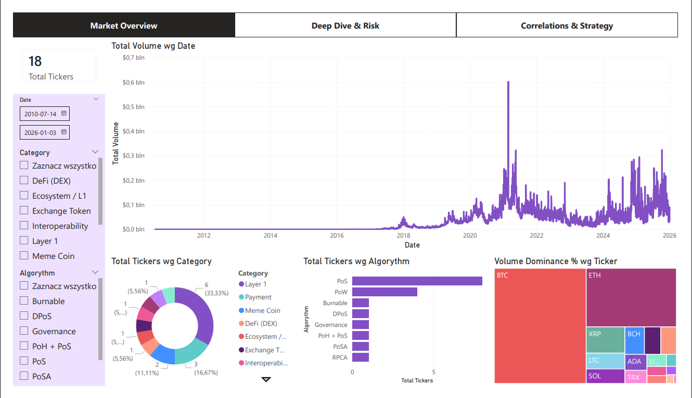
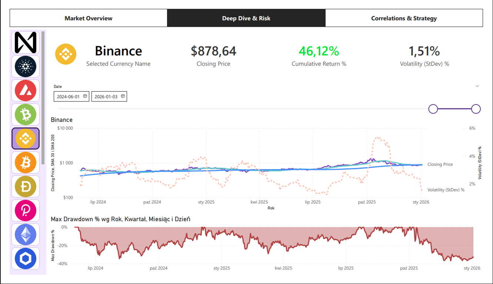
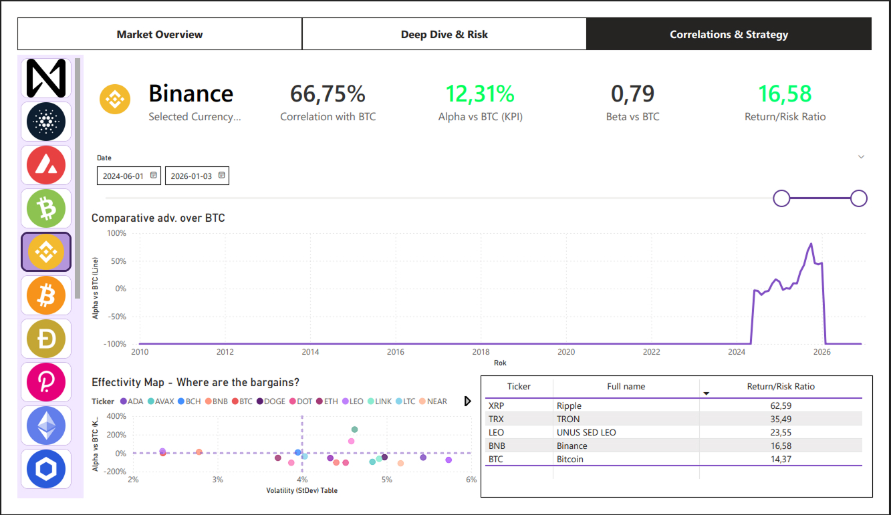

# Cryptocurrency Market Analysis Dashboard

## Business Case
The goal of this project was to create an interactive analytical tool for monitoring the cryptocurrency market, assessing investment risk, and identifying optimal market strategies. Designed for investors and financial analysts, the dashboard enables a seamless transition from a macro market overview to an in-depth micro analysis of individual assets, heavily emphasizing key risk management metrics.

## Data & Tools
* **Tool:** Power BI (Power Query, DAX, Data Modeling)
* **Data Source:** [Kaggle] covering historical market data up to January 2026.
* **Data Scope:** Trading volumes, closing prices, project categories (e.g., DeFi, Layer 1, Meme Coins), and network consensus algorithms (PoS, PoW).

## Key Features & Structure

The dashboard is divided into three main analytical modules:

### 1. Market Overview
* Macro-level analysis of global market volume and liquidity over time.
* Treemap visualization displaying the volume dominance of key market players (e.g., BTC, ETH, XRP).
* Breakdown of projects by category and security algorithms.

### 2. Deep Dive & Risk
* Detailed individual asset view with an interactive selection menu.
* **Technical Analysis:** Price charts benchmarked against simple moving averages (**SMA 30 & SMA 200**).
* **Risk Metrics:** Live, dynamic calculations of Cumulative Return, Volatility (StDev), and **Max Drawdown %**, which is a crucial KPI for portfolio risk management.

### 3. Correlations & Strategy
* **Advanced Financial KPIs:** Evaluating alternative projects against a market benchmark (Bitcoin) utilizing **Alpha** (excess return) and **Beta** (systematic risk measure).
* **Effectivity Map:** A scatter plot correlating Alpha with Volatility, visually identifying investment "bargains" that offer the most favorable Return/Risk Ratio.

